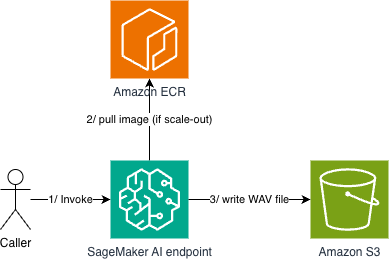

# Kokoro TTS — Amazon SageMaker AI Async Inference Endpoint

This sample deploys [Kokoro-82M](https://huggingface.co/hexgrad/Kokoro-82M) as a scale-to-zero Amazon SageMaker AI asynchronous inference endpoint. Text in, WAV out. Supports 28 English voices (British and American), configurable speech speed, and handles long-form text via chunked streaming synthesis.

> **Note**: This is sample code intended for educational and demonstration purposes only. It is not hardened for production use. Deploy it into a non-production environment and review and adapt it to meet your own security and operational requirements before any production use.

## Architecture



1. **Invoke** — a caller invokes the endpoint with the JSON request payload (`text`).
2. **Pull image (if scale-out)** — when the endpoint scales out (for example from zero), it pulls the container image from Amazon ECR. The Kokoro model weights and voices are baked into the image at build time, so no model download happens at runtime.
3. **Write WAV file** — the endpoint synthesizes the audio and writes the WAV file to the S3 bucket.

The AWS CloudFormation stack (`template.yaml`) provisions:

- **Amazon S3 bucket** for async input/output with a 7-day lifecycle policy
- **AWS IAM execution role** with least-privilege access (S3 I/O, Amazon Elastic Container Registry (Amazon ECR) pull, Amazon CloudWatch Logs)
- **SageMaker AI Model / EndpointConfig / Endpoint** running the custom container
- **AWS Application Auto Scaling** with scale-to-zero (step policy on `HasBacklogWithoutCapacity`) and backlog-based scale-out (target tracking on `ApproximateBacklogSizePerInstance`)

## Project Structure

```
.
├── docker/
│   ├── Dockerfile          # Extends the PyTorch inference DLC with Kokoro + voices
│   ├── requirements.txt    # Pinned Python deps layered onto the DLC
│   └── voices.env          # Voice list (single source of truth for build + tests)
├── scripts/
│   ├── build_image.sh      # Build and push the inference image to ECR
│   ├── deploy.sh           # Deploy the CloudFormation stack
│   └── teardown.sh         # Delete the stack (empties the S3 bucket first)
├── src/
│   ├── inference.py        # SageMaker AI inference handler (model_fn, input_fn, predict_fn, output_fn)
│   └── prime.py            # Build-time script to warm model weights + voice tensors into HF cache
├── tests/
│   ├── test_handler_contract.py        # Unit tests for the handler input/output contract
│   └── integration/
│       └── test_invoke_async.py        # Integration test against a deployed endpoint
└── template.yaml           # CloudFormation template
```

## Prerequisites

- An AWS account with permissions to create ECR repositories, CloudFormation stacks, SageMaker AI endpoints, and IAM roles
- AWS CLI v2 configured with appropriate credentials
- Docker with buildx (for cross-platform builds from Apple Silicon)

## Deployment

**Cost Notice**: This deployment creates billable AWS resources including SageMaker AI GPU instances (ml.g4dn.xlarge by default), S3 storage, and more. The endpoint scales to zero when idle to minimize costs, but some charges (e.g., S3 storage) continue until cleanup. See the [Clean Up](#clean-up) section to remove all resources when finished.

### 1. Build and push the container image

```bash
./scripts/build_image.sh
# Override the tag: TAG=2026-06-17 ./scripts/build_image.sh
```

This creates the ECR repository (if it does not exist), authenticates Docker to ECR, and pushes a linux/amd64 image.

### 2. Deploy the endpoint

```bash
./scripts/deploy.sh
# Override the tag: TAG=2026-06-17 ./scripts/deploy.sh
# Override the stack name: STACK_NAME=my-stack ./scripts/deploy.sh
```

On success, the script prints a table of stack outputs (endpoint name, bucket, S3 prefixes). If the deployment fails, the script exits with a non-zero status before reaching that output.

### 3. Verify the deployment

Confirm the endpoint is ready:

```bash
aws sagemaker describe-endpoint --endpoint-name <endpoint-name> --query "EndpointStatus"
```

The response should be `"InService"`.

### 4. Test the endpoint

See [tests/integration/test_invoke_async.py](tests/integration/test_invoke_async.py) for an example of invoking the endpoint programmatically. The first request after idle wakes the instance from zero — expect around 9 minutes of cold start.

## Configuration

Key CloudFormation parameters (add `--parameter-overrides` to the `aws cloudformation deploy` command in `deploy.sh`):

```bash
aws cloudformation deploy \
    --parameter-overrides "InstanceType=ml.g5.xlarge" "MaxAutoscaleCapacity=4"
```

| Parameter                             | Default          | Description                             |
| ------------------------------------- | ---------------- | --------------------------------------- |
| `InstanceType`                        | `ml.g4dn.xlarge` | GPU instance type                       |
| `MaxAutoscaleCapacity`                | `2`              | Max instances on scale-out              |
| `BacklogTargetPerInstance`            | `5`              | Target backlog per instance for scaling |
| `MaxConcurrentInvocationsPerInstance` | `4`              | Async concurrency cap per instance      |

## Request Format

```json
{
  "text": "Hello from Kokoro.",
  "voice": "af_bella",
  "speed": 1.0,
  "split_pattern": "\n\n+"
}
```

Only `text` is required. The response is a 24 kHz mono WAV written to the S3 output prefix.

## Available Voices

See [`docker/voices.env`](docker/voices.env) for the full list of supported voices. Prefixes: `af_` = American female, `am_` = American male, `bf_` = British female, `bm_` = British male.

> **Note**: The pipeline defaults to the British English grapheme-to-phoneme (G2P) (`lang_code="b"` in `src/inference.py`). Set `lang_code` to `"a"` for American English pronunciation.

## Development

Requires Python 3.12+ and [uv](https://github.com/astral-sh/uv).

### Unit tests (handler contract)

```bash
uv run pytest -v
```

### Integration tests (deployed endpoint)

```bash
uv run pytest tests/integration/ -v
# Target a different stack: STACK_NAME=my-stack uv run pytest tests/integration/ -v
```

## Clean Up

> **Warning**: Running teardown will permanently delete all data in the S3 bucket, including any inference outputs. Ensure you have backed up any data you need before proceeding.

```bash
./scripts/teardown.sh
```

This empties both S3 buckets (async I/O and access logs) and deletes the CloudFormation stack (endpoint, model, IAM role, and both buckets). The Amazon ECR repository is created outside the stack and must be deleted separately if no longer needed:

```bash
aws ecr delete-repository --repository-name oss-tts/kokoro-inference --region eu-west-2 --force
```

## Conclusion

This solution deploys a text-to-speech pipeline using Amazon SageMaker AI asynchronous inference with automatic scale-to-zero. The architecture minimises costs during idle periods while handling bursts of synthesis requests. The included CloudFormation template and container image provide a complete, reproducible deployment that can be customised for your specific latency and throughput requirements.

## License

This library is licensed under the MIT-0 License. See the [LICENSE](LICENSE) file.
